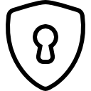
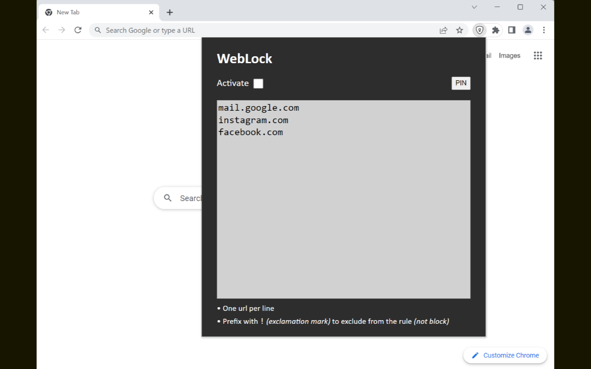
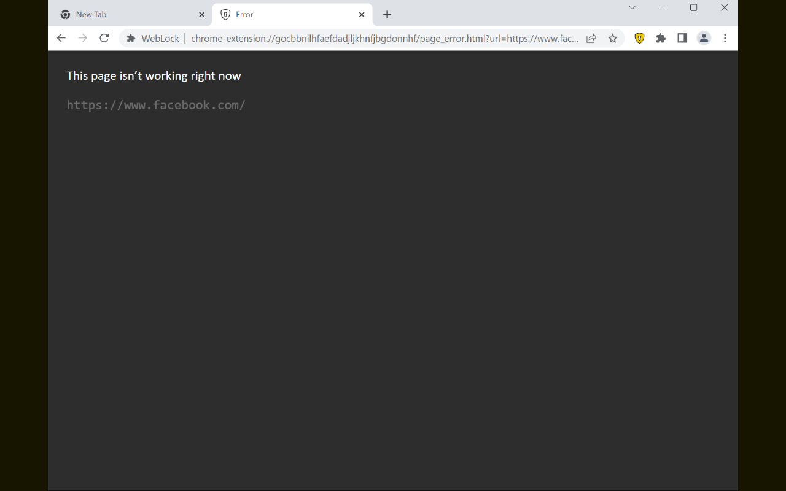

# Web Lock

## Overview
Chromium-based extension to temporarily block access to a list of websites.

When blocking is enabled, any of the desired websites will display an error every time access is attempted.

You can also set a PIN to access the extension and disable the lock.

It is possible to block only subdomains or subdirectories, instead of an entire website.
See some examples in the extension itself.

## Installation

### From the Chrome Web Store
- Download the extension from the [Chrome Web Store](https://chromewebstore.google.com/detail/weblock/liefgbafdofhlkmccpgfnledbigaiona) (link to the store).

### Using the source code

1. Download the source code.
2. Open the browser and go to `chrome://extensions/`, `edge://extensions/`, etc.
3. Enable 'Developer mode'.
4. Click on 'Load unpacked' button.
5. Navigate to and select the root directory of the extension's source code (where the `manifest.json` file is located).
6. The extension should now be installed and appear in your list of extensions.
7. If you make changes to the extension, click the 'Reload' button on the extension's card to apply the changes.

### Screenshots

